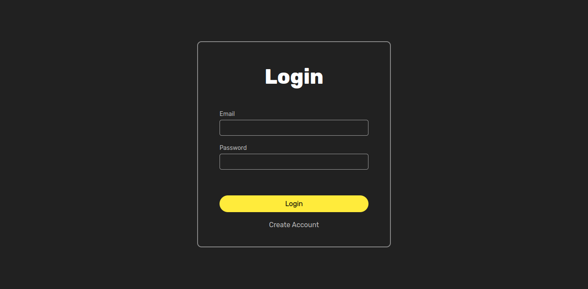
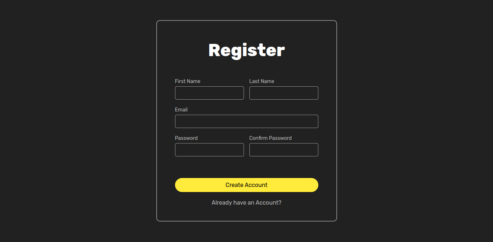
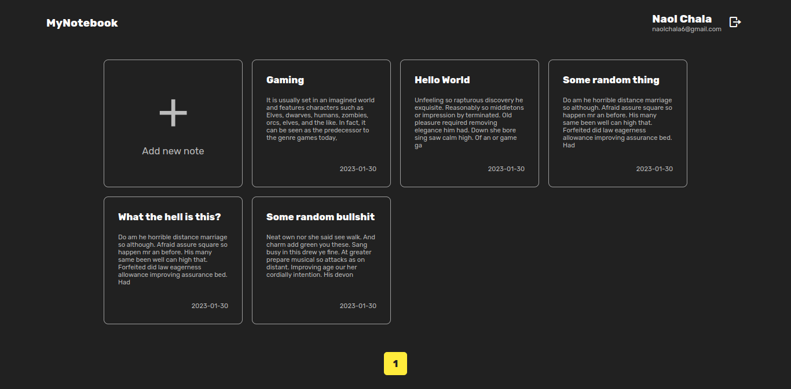
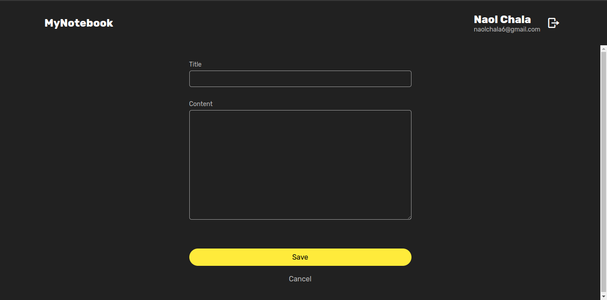
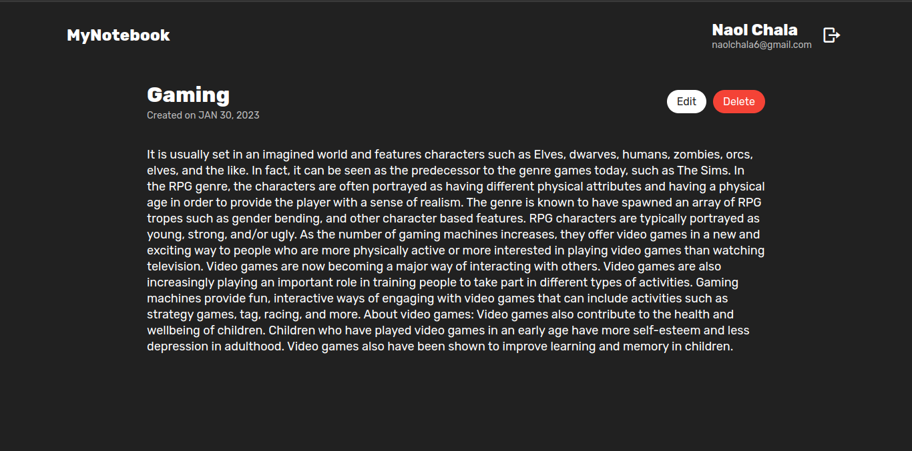

# Note App

### Developed with Java Servlet

## Running on your machine

1. Install `mysql`, `tomcat server`, `apache netbeans`
2. On your mysql database create a database called `NoteApp`
3. Run `NoteApp.sql` file on your database
4. Open `Netbeans` and Open the Project and run it 🚀

## Pages

